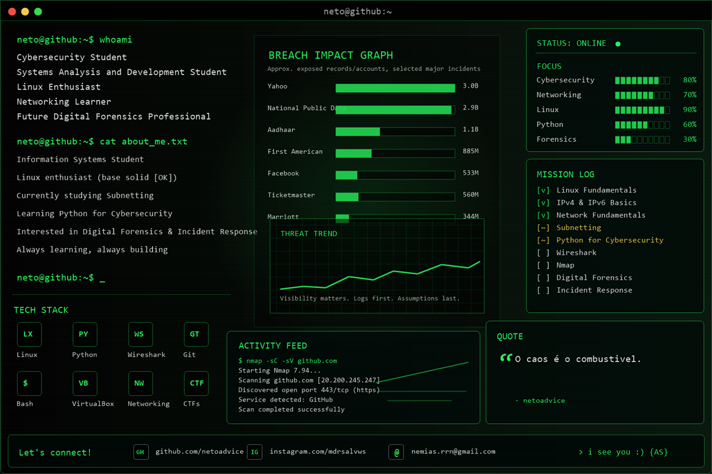

O// 

  

# Neto

Cybersecurity Student | Linux Enthusiast | Networking Learner

## About me

- Information Systems Student
- Linux enthusiast
- Currently studying Subnetting
- Python for Cybersecurity
- Interested in Digital Forensics and Incident Response
- Always learning, always building

## Tech Stack

Windows|Linux | Python | Wireshark | Git | Bash | VirtualBox | Networking | CTFs

## Connect

- GitHub: `github.com/netoadvice`
- Email: `vascodagamamae@gmail.com.`
